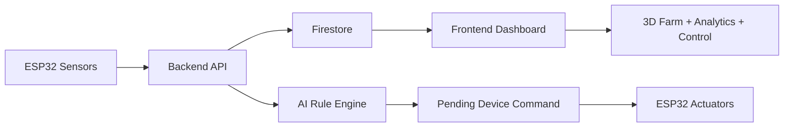
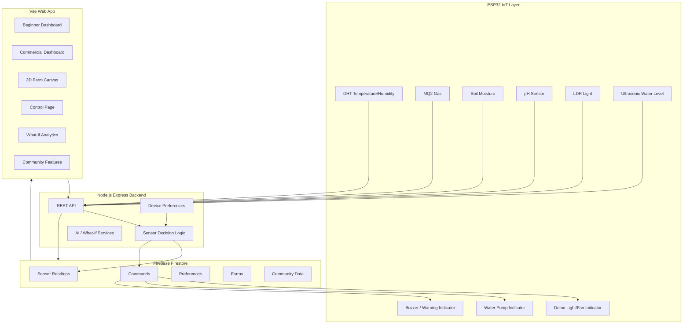

# SeedDown 🌱

<p align="center">
  <b>AI + IoT smart vertical farming platform for real-time crop monitoring, automated farm actions, 3D farm planning, eco-saving alerts, and community-driven urban agriculture.</b>
</p>

<p align="center">
  
  
  
  
  
</p>

---

## Table of Contents

- [Track & Problem Statement](#track--problem-statement-mag_right)
- [Introduction](#introduction-mega)
- [Solution Overview](#solution-overview-seedling)
- [Core Features](#core-features-star2)
- [Technical Stack](#technical-stack-computer)
- [System Architecture](#system-architecture-building_construction)
- [IoT Automation Logic](#iot-automation-logic-satellite)
- [Real-Life Deployment Budget](#real-life-deployment-budget-money_with_wings)
- [Installation](#installation-link)
- [Environment Variables](#environment-variables-lock)
- [Render Deployment](#render-deployment-rocket)
- [API Reference](#api-reference-electric_plug)
- [Project Structure](#project-structure-open_file_folder)
- [Demo Flow](#demo-flow-movie_camera)
- [Future Improvements](#future-improvements-rocket)
- [Documentation](#documentation-page_facing_up)
- [Contributors](#contributors-woman_technologist)

---

## Track & Problem Statement :mag_right:

**Hackathon:** UTMxHackathon'26  
**Chosen Case Study:** Case Study 1 - **Precision Urban Agriculture for Vertical Farming**  
**Solution Type:** IoT System + Web Dashboard + Mobile-responsive Web Application  
**Project:** SeedDown

**Problem Statement:**  
Rapid urbanization, shrinking arable land, and climate change are increasing pressure on traditional food supply chains. Vertical farming offers a space-efficient and sustainable way to grow crops in controlled indoor environments, but managing these systems manually is still resource-intensive and error-prone.

For beginner growers, community gardens, and indoor campus greenhouses, the main challenges are:

1. **Lack of real-time visibility** into temperature, humidity, soil moisture, pH, gas, light, and water level.
2. **Manual control of lighting, watering, ventilation, and safety response**, which can cause poor crop growth, wasted water, and high energy usage.
3. **Limited access to affordable, data-driven automation tools** that can monitor crops around the clock and recommend practical improvements.
4. **High entry barrier** for planning a vertical farm layout, understanding plant performance, and scaling from a hobby setup to a commercial dashboard.

SeedDown answers Case Study 1 by combining a functional ESP32 IoT prototype, a centralized web dashboard, automated device commands, predictive alerts, AI-supported plant guidance, and interactive 3D vertical farm planning. It is designed to help users maximize crop yield while minimizing water and electricity usage.

---

## Introduction :mega:

**SeedDown** is a smart vertical farming system that connects an **ESP32 IoT device**, a **Node.js backend**, **Firebase Firestore**, and a responsive **web dashboard**.

The platform turns live sensor readings into practical farm actions:

- Detect unsafe gas, temperature, pH, light, water, and soil moisture readings.
- Store real-time readings in Firestore.
- Generate pending commands for the ESP32 such as `WATER_ON`, `LIGHT_ON`, `BUZZER_ON`, and `PH_WARNING`.
- Let users build a vertical farm field with different rack structures and plant placements.
- Display the farm as a responsive 3D canvas.
- Provide beginner-friendly guidance and commercial-level analytics.

The product is designed for two user groups:

1. **Beginner Mode**: simple, gamified, guided farm management without registration.
2. **Commercial Mode**: richer dashboard, automation control, thresholds, profit, energy, ESG, and What-If analysis.

---

## Solution Overview :seedling:

SeedDown is built around one continuous loop:



The ESP32 sends live sensor data to the backend. The backend stores the reading, analyzes it against user preferences, and creates a command when action is needed. The frontend reads the data and shows it through a responsive dashboard, 3D farm canvas, advisor cards, and analytics pages.

---

## Core Features :star2:

### 1. Real-Time IoT Farm Monitoring 📡

- ESP32 reads farm environment data:
  - Temperature
  - Humidity
  - MQ2 gas raw value
  - Soil moisture raw value
  - pH raw value and mapped pH
  - Light raw value
  - Water distance using ultrasonic sensor
- Sends readings to backend through:

```http
POST /api/sensors
```

- Frontend displays live readings through beginner and commercial dashboards.

### 2. Automated Farm Commands ⚙️

The backend analyzes each sensor cycle and creates an action command when needed:

- `BUZZER_ON` for dangerous gas or abnormal temperature.
- `WATER_ON` when soil is below dry threshold.
- `LIGHT_ON` when `lightRaw < 1500`.
- `PH_WARNING` when pH is outside the safe range.
- `NO_ACTION` when the environment is stable.
- Multiple abnormal readings can return combined commands, for example `BUZZER_ON,LIGHT_ON`.

ESP32 pulls the latest command through:

```http
GET /api/sensors/command?deviceId=farm_001&format=text
```

The command can also update the ESP32 sampling interval based on user profile settings.

### 3. AI Alert & Predictive Warnings 🚨

SeedDown includes an AI-assisted alert layer that turns raw sensor values into understandable farm warnings:

- Detects abnormal temperature, pH, gas, light, water, and soil moisture readings.
- Classifies farm status into stable, warning, or danger conditions.
- Shows beginner-friendly alert cards instead of only raw numbers.
- Supports urgent actuator responses such as buzzer alerts for unsafe gas or extreme temperature, plus pH warning alerts for nutrient imbalance.
- Helps users understand why a warning is happening and what action should be taken next.
- Provides commercial users with threshold-based controls so alert sensitivity can match different crops and farm setups.

This directly supports the Case Study 1 requirement for predictive alerts, such as detecting system anomalies before they damage crops or waste resources.

### 4. Eco Save & Resource Optimization ♻️

Eco Save focuses on reducing water and electricity waste while keeping plants healthy:

- Water-saving logic activates watering only when soil moisture falls below the dry threshold.
- Light-saving logic turns on grow lights only when the light sensor indicates low brightness.
- Sensor interval settings reduce unnecessary data cycles when the farm is stable.
- Energy analysis estimates electricity usage and smart automation savings.
- ESG / consumption tracking helps users understand resource impact over time.
- What-If analysis compares plant choices, rack capacity, and resource usage before users expand the farm.

Instead of running pumps, lights, fans, or warning systems continuously, SeedDown reacts to real sensor conditions. This helps align the prototype with the case study goal of maximizing crop yield while minimizing water and electricity usage.

### 5. Beginner Mode 🌱

Beginner mode is built for new growers:

- No registration required.
- Gamified visual farm dashboard.
- Live data cards.
- Farm Advisor with simple, friendly recommendations.
- AI alert cards that explain farm issues in simple language.
- Eco Save indicators for water, light, and energy-conscious decisions.
- Add/change/delete plants from the farm layout.
- 3D farm canvas with emoji-style plant visualization.
- Profile only focuses on sensor interval and basic automation settings.

### 6. Commercial Mode 🏭

Commercial mode adds deeper operational features:

- Terms and password/key gate before entering commercial controls.
- Commercial dashboard with larger farm view.
- Profit analysis.
- Energy analysis.
- ESG / consumption tracking.
- Sensor threshold control page.
- Manual actuator commands.
- Emergency stop.
- AI alert and control automation for abnormal farm conditions.
- Eco Save reporting for water, light, and energy optimization.
- What-If Pro analysis for crop planning and resource impact.

### 7. 3D Vertical Farm Builder 🧱

Users can create a new field through a guided flow:

1. Enter field details such as name, location, target plant, and analysis goal.
2. Choose a vertical farm structure:
   - 2-Tier Starter Rack
   - 3-Tier Vertical Rack
   - 4-Tier Grow Shelf
   - 5-Tier Tower Rack
   - Wall Panel Grid
   - A-Frame Pyramid
   - NFT Channel Rows
   - Hanging Column Farm
3. Upload or capture a plant photo.
4. Use Firebase AI / Gemini-compatible recognition when configured.
5. Fall back to target-plant detection when AI quota or keys are unavailable.
6. Generate a responsive 3D preview using Three.js.

Users can place crops in specific rack slots, such as cucumber on tier 1 slots 1 and 3, or tomato in middle tiers.

### 8. Add, Change, and Delete Plants 🪴

The plant manager supports:

- Selecting a crop type.
- Selecting an empty or occupied tile.
- Adding a new plant.
- Changing an existing plant.
- Removing a plant.
- Refreshing the 3D farm canvas immediately after changes.

### 9. Farm List and Field Management 🗂️

Users can manage multiple fields:

- Create new fields.
- Open an existing beginner or commercial field.
- View field details:
  - Created date
  - Location
  - Rack type
  - Plant count
  - Slots
  - Analysis goal
  - Plant map
- Delete fields from local storage / Firestore-linked user data.

### 10. AI Farm Advisor 🤖

The dashboard includes advisor cards that respond to farm status:

- Stable conditions: general encouragement.
- Warning readings: guided attention.
- Danger readings: urgent alerts.
- Ready plants: harvest tips.
- Eco Save suggestions when water, light, or energy usage can be improved.
- Crop-specific guidance based on selected plant goals and current sensor readings.

The chat service also connects to backend advisor endpoints when available.

### 11. What-If and Commercial Planning 🔮

SeedDown includes planning tools for both beginner and commercial users:

- Forecast crop yield.
- Estimate profit based on plant count and sensor data.
- Analyze energy consumption and smart automation savings.
- Simulate adding a new plant type.
- Evaluate zone capacity and resource impact.
- Recommend recipes or usage ideas based on available crops.

### 12. Community Farming Ecosystem 🏘️

Community features make the platform more engaging:

- SOS plant help posts.
- Comment and reward helpful neighbors.
- Barter marketplace for crops, seeds, and supplies.
- Reserve and complete barter items.
- Visit neighbor farms.
- Help water plants or catch bugs for reward coins.

---

## Technical Stack :computer:

### Frontend

- Vite
- Vanilla JavaScript modules
- Firebase Web SDK
- Three.js
- Chart.js for selected analysis views
- Responsive CSS with mobile-first dashboard behavior

### Backend

- Node.js
- Express.js
- Firebase Admin SDK
- Firestore
- Node Fetch
- REST API routes for sensors, farms, crops, community, chat, and What-If features

### IoT

- ESP32
- PlatformIO
- Wokwi-compatible simulation
- DHT sensor
- MQ2 gas sensor
- Soil moisture sensor
- pH analog input
- LDR light sensor
- Ultrasonic water level sensor
- LED / buzzer output simulation for hardware that is unavailable in Wokwi

### AI / Data

- Firebase AI Logic / Gemini-compatible plant recognition on frontend
- Gemini API compatible backend route for plant recognition fallback
- Optional Claude-compatible advisor service in backend
- Firestore collections for readings, commands, preferences, farms, community posts, and barter items

---

## System Architecture :building_construction:



---

## IoT Automation Logic :satellite:

The backend evaluates each incoming reading using stored preferences.

| Condition | Command | Wokwi Simulation | Real-Life Deployment Meaning |
|---|---|---|---|
| Gas level is abnormal | `BUZZER_ON` | Buzzer turns on | Ventilation fan / exhaust fan / safety alarm activates |
| Temperature `< 18°C` or `> 35°C` | `BUZZER_ON` | Buzzer turns on | Cooling fan, ventilation, heater, or climate-control alert activates |
| Soil moisture is dry | `WATER_ON` | Water LED / pump indicator turns on | Water pump or hydroponic pump relay activates |
| `lightRaw < 1500` | `LIGHT_ON` | LED indicator turns on | Grow light relay or lighting zone activates |
| pH is outside safe range | `PH_WARNING` | Warning message / indicator | Nutrient dosing alert, pH-up / pH-down maintenance reminder, or dosing pump trigger |
| Multiple values are abnormal | Example: `BUZZER_ON,LIGHT_ON` | Multiple indicators activate together | Multiple actuators or alerts can run in the same cycle |
| All values stable | `NO_ACTION` | Device stays idle | No actuator is triggered |

In the Wokwi simulation, some outputs act as stand-ins because the simulator does not include the full real-life farm hardware stack. For example, an LED may represent a grow light relay, a fan relay, or a pump indicator depending on the command being demonstrated. In a physical prototype, those pins can be connected to relay modules controlling the actual pump, grow light, ventilation fan, buzzer, or pH dosing system.

The ESP32 supports demo commands through serial input:

```text
interval 10   # change sensing interval to 10 seconds
default       # reset final interval to 1 hour
demo          # use demo interval
```

---

## Real-Life Deployment Budget :money_with_wings:

The current prototype is demonstrated with Wokwi, but the same logic can be deployed with low-cost ESP32-compatible hardware. Prices below are approximate Malaysia budget estimates checked around May 2026; actual prices depend on seller, stock, shipping, and whether a cheaper clone or a more reliable branded module is chosen.

| Farm Function | Budget Hardware | ESP32 Connection | Approx. Cost (RM) | Why It Fits SeedDown | Real-Life Deployment Role |
|---|---|---|---:|---|---|
| Main controller | NodeMCU ESP32 / ESP32 DevKit | WiFi + GPIO + ADC + PWM | 24 - 35 | Built-in WiFi, enough analog/digital pins, Arduino/PlatformIO support | Sends sensor data to backend and receives farm commands |
| Air temperature + humidity | DHT11 module, or DHT22 if better accuracy is needed | Digital GPIO, 3.3V/5V | 5 - 16 | Cheapest option is enough for demo; DHT22 is more accurate for real farms | Detects heat stress and humidity imbalance |
| Soil moisture | Capacitive soil moisture sensor | Analog ADC | 10 - 20 | Capacitive type lasts longer than cheap resistive probes | Triggers `WATER_ON` only when soil is dry |
| Light level | LDR + resistor, or light sensor module | Analog ADC | 1 - 5 | Extremely cheap and easy to calibrate | Triggers `LIGHT_ON` when `lightRaw < 1500` |
| Gas / air safety | MQ-2 gas sensor module | Analog ADC or digital GPIO; use voltage divider if output exceeds 3.3V | 7 - 8 | Cheap safety sensor for smoke / LPG / gas demo | Triggers `BUZZER_ON` and real ventilation / alarm |
| Water reservoir level | HC-SR04 or SR04P ultrasonic sensor | Trigger GPIO + Echo GPIO; SR04P is easier for 3.3V | 3 - 5 | Low-cost non-contact water level sensing | Warns when tank is low or distance is abnormal |
| Water pH | Analog pH probe kit | Analog ADC, calibration required | 33 - 155 | Budget clone is cheapest; branded kit is more stable | Triggers `PH_WARNING` and nutrient maintenance alert |
| Pump control | 5V mini submersible pump + relay/MOSFET | GPIO to relay/MOSFET driver | 4 - 15 | Cheap enough for small hydroponic / irrigation demo | Real actuator for `WATER_ON` |
| Grow light control | 12V LED strip / grow light + relay/MOSFET | GPIO to relay/MOSFET driver | 10 - 30 | Relay/MOSFET lets ESP32 switch higher-power lights safely | Real actuator for `LIGHT_ON` |
| Ventilation / cooling | 5V/12V DC fan + relay/MOSFET | GPIO to relay/MOSFET driver | 15 - 18 | Represents the real response for abnormal gas or temperature | Real actuator for `BUZZER_ON` safety/climate events |
| Warning output | Active buzzer | Digital GPIO | 1 - 3 | Very cheap, clear demo feedback | Local alarm for dangerous readings |
| Safe switching | 3.3V-compatible relay module or logic-level MOSFET module | Digital GPIO | 5 - 50 | Needed because ESP32 pins cannot directly power pumps, lights, or fans | Protects ESP32 while switching real actuators |
| Power supply | 5V USB supply + 12V adapter if using fan/light | VIN/5V and actuator supply | 10 - 25 | Keeps sensors and actuators stable | Separates ESP32 power from pump/fan/light load |

**Estimated minimum small prototype cost:** around **RM130 - RM220** including pH sensing. Without pH hardware, the demo can be reduced to around **RM90 - RM140**.

**Important ESP32 wiring notes:**

- ESP32 GPIO is **3.3V logic**, so 5V sensor outputs such as some HC-SR04 Echo pins or MQ analog outputs may need a voltage divider before entering an ESP32 ADC/GPIO pin.
- Pumps, fans, and grow lights should not be powered directly from ESP32 pins. Use a relay module, logic-level MOSFET driver, and external power supply.
- pH probes need calibration using buffer solutions; cheap probes are acceptable for demo but commercial deployments should use better calibrated water-quality sensors.
- For commercial racks, one ESP32 can control one zone, or multiple ESP32 nodes can report to the same backend using different `deviceId` values.

Budget reference examples:

- [Cytron NodeMCU ESP32](https://my.cytron.io/p-nodemcu-esp32)
- [Cytron sensor catalogue: DHT11, DHT22, LDR, soil moisture, MQ2, SR04P](https://my.cytron.io/c-sensor)
- [Myduino MQ2 Gas / Smoke Sensor](https://myduino.com/product/jhs-289/)
- [GI Electronic HC-SR04 Ultrasonic Module](https://gie.com.my/shop.php?action=sensors%2Frange%2Fhc_sr04)
- [MakerHub 3V-5V Mini Water Pump](https://makerhub.my/shop/actuator/mini-water-pump-submersible-dc-3v-5v/)
- [Myduino 12V Cooling Fan](https://myduino.com/product/12x12cm-12038-dc-12v-1a-cooling-fan/)
- [Myduino Analog pH Sensor Kit](https://myduino.com/product/dfr-109/)

---

## Installation :link:

This project can be run in three parts:

1. Backend API
2. Frontend dashboard
3. ESP32 / Wokwi IoT simulation

### Prerequisites

- Node.js 18+
- npm
- Firebase project with Firestore enabled
- Render account for deployment
- PlatformIO or Wokwi for ESP32 simulation

### Clone Repository

```bash
git clone https://github.com/jiahui-1101/SeedDown.git
cd SeedDown
```

### Backend Setup

```bash
cd backend
npm install
npm start
```

Expected output:

```text
Firebase Firestore connected
SeedDown backend → http://localhost:3000
```

### Frontend Setup

Open a second terminal:

```bash
cd frontend
npm install
npm run dev
```

Open the Vite URL:

```text
http://localhost:5173
```

### Run Backend and Frontend Together

For the most reliable local demo, use two terminals:

```bash
# Terminal 1
cd backend
npm start
```

```bash
# Terminal 2
cd frontend
npm run dev
```

---

## Environment Variables :lock:

### Backend `.env`

Create `backend/.env`:

```env
PORT=3000
FIREBASE_PROJECT_ID=your-firebase-project-id

# Recommended for Render and deployment:
FIREBASE_SERVICE_ACCOUNT_JSON={"type":"service_account",...}

# Optional for local development:
GOOGLE_APPLICATION_CREDENTIALS=./firebase-service-account.json

# Optional AI keys:
GEMINI_API_KEY=your_gemini_key_here
GOOGLE_AI_API_KEY=your_google_ai_key_here
CLAUDE_API_KEY=your_claude_key_here
DA3_SERVICE_URL=your_depth_or_3d_service_url_here
```

> Do not commit `firebase-service-account.json`. It is already ignored by `.gitignore`.

### Frontend `.env`

Create `frontend/.env` if Firebase AI Logic is used:

```env
VITE_FIREBASE_API_KEY=your_web_api_key
VITE_FIREBASE_AUTH_DOMAIN=your_project.firebaseapp.com
VITE_FIREBASE_PROJECT_ID=your_project_id
VITE_FIREBASE_STORAGE_BUCKET=your_project.firebasestorage.app
VITE_FIREBASE_MESSAGING_SENDER_ID=your_sender_id
VITE_FIREBASE_APP_ID=your_web_app_id
VITE_FIREBASE_AI_MODEL=gemini-2.0-flash
```

If these values are not configured, plant recognition falls back to manual / target plant behavior.

---

## Render Deployment :rocket:

Deploy the backend as a Render Web Service.

### Recommended Render Settings

```text
Root Directory: backend
Build Command: npm install
Start Command: npm start
```

### Required Render Environment Variables

```text
FIREBASE_PROJECT_ID=your-firebase-project-id
FIREBASE_SERVICE_ACCOUNT_JSON={full service account JSON}
```

### Optional Render Environment Variables

```text
GEMINI_API_KEY=your_gemini_key
GOOGLE_AI_API_KEY=your_google_ai_key
CLAUDE_API_KEY=your_claude_key
DA3_SERVICE_URL=your_3d_service_url
```

### Test Render API

```powershell
$BASE="https://your-seeddown-backend.onrender.com"
Invoke-RestMethod "$BASE/"
Invoke-RestMethod "$BASE/api/sensors"
```

Test IoT POST:

```powershell
Invoke-RestMethod -Method POST -Uri "$BASE/api/sensors" -ContentType "application/json" -Body '{
  "deviceId":"farm_001",
  "temperature":25,
  "humidity":60,
  "gasRaw":1000,
  "soilRaw":900,
  "ph":6.1,
  "phRaw":1800,
  "lightRaw":2000,
  "waterDistanceCm":10,
  "intervalSeconds":5
}'
```

---

## API Reference :electric_plug:

### Health

| Method | Endpoint | Description |
|---|---|---|
| GET | `/` | API health message |

### Sensors and IoT

| Method | Endpoint | Description |
|---|---|---|
| GET | `/api/sensors` | Sensor route info |
| POST | `/api/sensors` | Create sensor reading and generate command |
| POST | `/api/sensors/data` | Alternative sensor reading endpoint |
| GET | `/api/sensors/latest?deviceId=farm_001` | Latest reading |
| GET | `/api/sensors/history?deviceId=farm_001&limit=20` | Sensor history |
| GET | `/api/sensors/command?deviceId=farm_001&format=text` | Pending device command for ESP32 |
| POST | `/api/sensors/command` | Manual command from control page |
| POST | `/api/sensors/command-result` | Mark command as executed |
| GET | `/api/sensors/preferences?deviceId=farm_001` | Get sensor thresholds/preferences |
| PUT | `/api/sensors/preferences` | Update thresholds/preferences |

### Farm Builder

| Method | Endpoint | Description |
|---|---|---|
| POST | `/api/farms/scan-plants` | AI plant scan from uploaded image |
| POST | `/api/farms/generate-3d` | Optional 3D generation proxy |
| POST | `/api/farms/create` | Persist farm metadata |

### What-If Analytics

| Method | Endpoint | Description |
|---|---|---|
| GET | `/api/whatif/recipes` | Recipe/crop recommendation data |
| POST | `/api/whatif/forecast` | Forecast crop yield |
| POST | `/api/whatif/costsaving` | Cost and savings analysis |
| POST | `/api/whatif/newplant` | New plant impact analysis |

### Community

| Method | Endpoint | Description |
|---|---|---|
| GET | `/api/community/me` | Get current demo user |
| POST | `/api/community/posts/sos` | Create plant SOS post |
| GET | `/api/community/posts` | List community posts |
| POST | `/api/community/posts/:postId/comments` | Add comment |
| POST | `/api/community/posts/:postId/like` | Like post |
| DELETE | `/api/community/posts/:postId` | Delete post |
| POST | `/api/community/posts/:postId/reward` | Reward helpful comment |
| GET | `/api/community/barter` | List barter items |
| POST | `/api/community/barter` | Create barter listing |
| POST | `/api/community/barter/:id/reserve` | Reserve barter item |
| POST | `/api/community/barter/:id/complete` | Complete barter trade |
| GET | `/api/community/visits/neighbors` | Get neighbor farms |
| POST | `/api/community/visits/water/:id` | Water neighbor farm |
| POST | `/api/community/visits/catch-bug/:id` | Catch bug in neighbor farm |

### AI Chat

| Method | Endpoint | Description |
|---|---|---|
| POST | `/api/chat` | Farm advisor chat response |

---

## Project Structure :open_file_folder:

```bash
SeedDown/
├── backend/                         # Node.js + Express API server
│   ├── src/
│   │   ├── config/                  # Firebase / Firestore config
│   │   ├── controllers/             # API controllers
│   │   ├── middleware/              # Express middleware
│   │   ├── models/                  # Firestore model wrapper and data models
│   │   ├── routes/                  # REST route definitions
│   │   └── services/                # Sensor logic and AI services
│   ├── crops_data.json              # Crop database
│   ├── garden_recipes.json          # Recipe/recommendation database
│   ├── seed_crops.js                # Crop seeding script
│   ├── test_sensor.js               # Backend sensor test helper
│   ├── app.js                       # Express app setup
│   ├── server.js                    # Server entrypoint
│   └── package.json
│
├── frontend/                        # Vite web dashboard
│   ├── css/
│   │   └── main.css                 # Global responsive UI styles
│   ├── js/
│   │   ├── components/              # FarmCanvas, SensorStrip, Advisor, Plant Modal
│   │   ├── pages/                   # App screens and dashboards
│   │   ├── pages/communityTabs/     # SOS, Barter, Visit Neighbor modules
│   │   ├── services/                # AI chat, Firebase AI logic, IoT simulator
│   │   ├── utils/                   # Navigation, Firebase helpers, toast
│   │   ├── main.js                  # Frontend entrypoint
│   │   └── store.js                 # Global app state
│   ├── index.html
│   └── package.json
│
├── iot/
│   └── vertical-farming-esp32/      # ESP32 / Wokwi / PlatformIO project
│       ├── src/main.cpp             # Sensor loop and backend communication
│       ├── diagram.json             # Wokwi circuit diagram
│       ├── platformio.ini           # PlatformIO config
│       └── wokwi.toml               # Wokwi config
│
├── shared/                          # Shared constants and types
│   ├── constants.js
│   └── types.js
│
├── package.json                     # Root fallback scripts for Render
└── README.md
```

---

## Demo Flow :movie_camera:

Use this flow for a hackathon presentation:

1. **Start with the problem**: growers cannot easily monitor and act on farm conditions in real time.
2. **Show Beginner Mode**: no registration, open a farm, view 3D farm, live data, and advisor.
3. **Add or change plants**: use the floating `+` button and update the 3D farm layout.
4. **Create a new field**: choose rack structure, plant goals, upload photo, and generate a 3D preview.
5. **Switch to Commercial Mode**: accept terms and enter password/key.
6. **Show analytics**: profit, energy, ESG, What-If Pro.
7. **Open Control Page**: change thresholds and send manual commands.
8. **Run ESP32 demo**: sensor values POST to Render backend, backend creates command, ESP32 executes action.
9. **Show community**: plant help posts, barter, neighbor visits.
10. **Close with impact**: one platform for beginner learning, commercial control, and sustainable vertical farming.

---

## Future Improvements :rocket:

SeedDown already demonstrates the end-to-end loop from IoT sensing to dashboard action. The next stage is to make the commercial side stronger for real farm operators.

### 1. Historical Data Intelligence

- Store long-term sensor history by farm, zone, crop type, rack tier, and planting batch.
- Compare current readings against previous successful grow cycles.
- Detect repeated patterns such as heat spikes at the same time each day.
- Build crop-specific baselines for lettuce, tomato, cucumber, herbs, and other vertical-farm crops.
- Show historical trends for water usage, light usage, pH stability, and energy cost.

### 2. Commercial Multi-Zone Control

- Support multiple ESP32 devices per commercial farm.
- Assign each `deviceId` to a zone, rack, floor, or crop batch.
- Give every zone its own thresholds, automation rules, and actuator mapping.
- Add zone status cards such as Healthy, Warning, Critical, Offline, or Maintenance Needed.
- Allow farm managers to compare zones side by side.

### 3. Smarter Automation Recipes

- Add crop profiles with recommended temperature, humidity, light, pH, and watering ranges.
- Let users choose automation mode:
  - Eco Save
  - Fast Growth
  - Balanced
  - Manual Override
- Recommend actuator schedules using both real-time readings and past performance.
- Add rule chaining, such as opening ventilation first before triggering a warning alarm.

### 4. Predictive Maintenance

- Detect pump failure when soil stays dry even after `WATER_ON`.
- Detect light failure when `LIGHT_ON` is triggered but light readings remain low.
- Detect sensor drift when readings become unrealistic or remain unchanged for too long.
- Notify users when pH probe calibration is due.
- Track actuator usage hours for pump, fan, light, and relay replacement planning.

### 5. Commercial Reporting

- Export CSV / PDF reports for sensor history, crop yield, energy usage, and alerts.
- Generate weekly farm performance summaries.
- Show cost per crop batch and estimated profit per rack.
- Add ESG reporting for saved water, reduced electricity waste, and local-food impact.
- Add role-based access for owner, operator, technician, and viewer.

### 6. Better AI and Computer Vision

- Use plant photos over time to detect growth rate, yellowing leaves, wilting, and possible disease.
- Combine image analysis with sensor trends for more accurate recommendations.
- Recommend harvest timing using plant age, size, crop profile, and environmental history.
- Improve recognition fallback when Gemini / Firebase AI quota is unavailable.

### 7. Scaling Beyond Prototype

- Add MQTT or WebSocket streaming for faster real-time commercial dashboards.
- Add offline buffering on ESP32 so readings are not lost during WiFi downtime.
- Support LoRa / ESP-NOW gateways for larger farm spaces.
- Add OTA firmware updates so commercial devices can be updated remotely.
- Add secure device authentication before accepting sensor data.

---

## Documentation :page_facing_up:

- **Pitch Deck:** `slide.link`
- **Demo Video:** `video.link`
- **Backend URL:** `https://your-seeddown-backend.onrender.com`
- **IoT Firmware:** `iot/vertical-farming-esp32/src/main.cpp`
- **Frontend Entry:** `frontend/index.html`
- **Backend Entry:** `backend/server.js`

---

## Contributors :woman_technologist:

Team **next level utm**

- Wong Jia Hui
- Lee Mei Shuet
- Loh Su Ting
- Christ Ting Shin Ling
- Wong Zi Qi

---

## Notes for Judges

SeedDown is not only a dashboard. It is an end-to-end prototype connecting:

```text
Physical IoT simulation → Cloud API → Firestore → AI logic → Web dashboard → Farm action
```

The project demonstrates real-time sensing, automated decision-making, responsive 3D visualization, beginner/commercial user modes, and community-based farming support in one integrated system.
